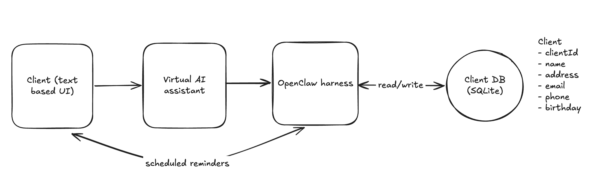
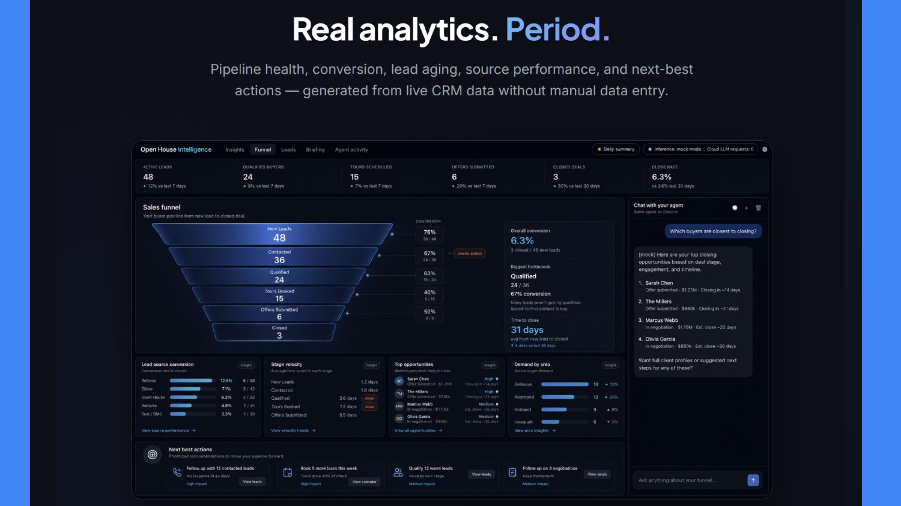

# OpenHouse Intelligence

**Your AI-powered operating system for the modern real estate agent.** Spend less time managing your CRM. Spend more time building relationships.

Real estate agents have data everywhere but intelligence nowhere — leads scattered across text messages, voice notes, emails, business cards, spreadsheets, and legacy CRMs, where information gets lost and nothing helps the agent get better. OpenHouse Intelligence turns those scattered conversations into an intelligent, always-on real estate operation: **just tell your agent what happened** ("I met Sarah Chen at the open house — she wants a 3-bed in Bellevue under $1.2M") and the AI reads and writes the CRM through natural language, drafts the follow-ups, books the tours, and generates real analytics — pipeline health, conversion, lead aging, source performance, next-best actions — with zero manual data entry. The result: less administration, faster follow-up, more closed deals.

And it's **local-first**: inference runs on your own machine (a local model via OpenClaw — originally demoed on a Dell Pro Max GB10 running Qwen 3.6 35B-A3B, but any tool-capable local model works), so client PII — budgets, financial situations, relocation reasons — never leaves the machine. Full story: [`docs/OpenHouse-Pitch.pdf`](docs/OpenHouse-Pitch.pdf).

**[`docs/CONTRACT.md`](docs/CONTRACT.md) is the frozen schema/API/tool contract — read it before writing code.** [`docs/history/PLAN.md`](docs/history/PLAN.md) is the original hackathon plan, kept for history; statuses, pages, and scope have evolved since (the contract is the source of truth).

## Quickstart

```bash
git clone <this repo> && cd open-intelligence-crm
bash scripts/dev.sh
```

Needs Python 3.11+ and Node 20+ on your PATH; the first run takes a few minutes while it creates a venv and installs `pip`/`npm` dependencies.

Open **http://localhost:5173**. That's it — you're running the full product in **mock-agent mode**: every dashboard page, the chat rail, business-card scan, follow-up drafts, and the daily briefing all work against a deterministic mock agent (canned, realistic AI responses) and a seeded set of 15 demo leads. No GPU, no local model, and no API keys required.

**Another industry?** The real-estate specifics — funnel stages, field labels, UI copy, personas, and the market-research scope — live in a swappable [vertical pack](docs/VERTICALS.md). Example packs for B2B SaaS, insurance, and recruiting ship in `verticals/`.

**Going fully local:** to swap the mock agent for a real local model (any tool-capable model, not just the hardware this project was built on), see [`docs/LOCAL-AI.md`](docs/LOCAL-AI.md).

## Architecture


<details>
<summary>Original whiteboard sketch this grew from</summary>



</details>

## One-command startup (dev, mock agent)

```bash
bash scripts/dev.sh
```

Seeds the database and starts the backend (http://localhost:8000, mock agent mode) + dashboard (http://localhost:5173). API docs at http://localhost:8000/docs.

## Production (real agent)

```bash
bash scripts/serve.sh
```

Builds the dashboard and serves the whole product from **one port** (default `:8080`) with `AGENT_MODE=openclaw`, relaying chat to a local OpenClaw gateway. Hardware-agnostic setup guide: [`docs/LOCAL-AI.md`](docs/LOCAL-AI.md). [`docs/GB10-SETUP.md`](docs/GB10-SETUP.md) walks through one example deployment (the original demo hardware) end to end. (`scripts/gb10.sh` still works as a compat shim for `serve.sh`.)

## What's in the dashboard



- `/` — the dashboard: live KPI strip in the navbar, sales funnel (with derived Qualified / Offers Submitted stages), and the deterministic insights engine (`dashboard/src/insights.ts` — computed from DB data, never LLM-invented)
- `/leads` — prioritized inbox with the "Needs attention" neglect section
- `/scan` — business-card capture with camera relay into lead intake
- `/lead/:id` — profile: persona chip + AI relationship summary, activity timeline, follow-up draft with closed-loop "Mark as sent", booking, client-safe export, merge review
- `/activity` — agent audit stream (every tool call), reachable from the dev icon in the navbar
- Global resizable **chat rail** — sessions, markdown rendering, `[Name](lead:12)` links into profiles
- **Daily summary overlay** — auto-opens once per day; "↻ Refresh now" asks the agent (chat session `summary-trigger`) to re-run research and repost

## Manual setup

```bash
# backend (Python 3.11+)
python3 -m venv .venv && .venv/bin/pip install -r backend/requirements.txt
.venv/bin/python backend/seed.py --demo
cd backend && ../.venv/bin/uvicorn app.main:app --reload --port 8000

# dashboard (Node 20+), separate terminal
cd dashboard && npm install && npm run dev
```

## Project layout

| Path | Holds | Start here |
|---|---|---|
| `backend/` | FastAPI app, SQLite schema & business logic | schema in `backend/schema.sql`, scoring weights in `app/scoring.py`, seed data in `seed.py`, agent drivers in `app/agent/` (`mock.py` for dev, `openclaw.py` for the real relay) |
| `dashboard/` | React + TypeScript + Vite frontend | typed API client in `src/api.ts`, deterministic insights in `src/insights.ts` |
| `skills/` | Stdlib-only tools the agent calls (never third-party deps) | one directory per skill — `crm-db-operations/` (`SKILL.md` + `tools.py`) is the core one; `business-card-scanner/` and `daily-command-center/` build on it; `composio-email-calendar/` is the optional Gmail/Calendar integration |
| `docs/` | Design docs, the frozen contract, setup guides | [`docs/CONTRACT.md`](docs/CONTRACT.md) is the schema/API/tool source of truth; [`docs/LOCAL-AI.md`](docs/LOCAL-AI.md) for running a real local model |
| `scripts/` | Dev & production launchers | `dev.sh` (mock mode), `serve.sh` (production, real agent) |

The contract (`docs/CONTRACT.md`) is frozen — breaking changes go through an issue/PR discussion, per [`CONTRIBUTING.md`](CONTRIBUTING.md).

## Environment variables

| Var | Default | Meaning |
|---|---|---|
| `AGENT_MODE` | `mock` | `mock` (dev, no local model needed) or `openclaw` (relay to a real local model via OpenClaw) |
| `AGENT_GATEWAY_URL` | `http://gb10:18789` | OpenClaw gateway; default hostname is from the original demo box (see [`docs/LOCAL-AI.md`](docs/LOCAL-AI.md)) — `scripts/serve.sh` overrides to `http://localhost:18789` when backend and gateway share the same box |
| `AGENT_GATEWAY_TOKEN` | — | Gateway bearer token — only needed if the gateway has token auth enabled (default is `gateway.auth.mode: "none"`) |
| `AGENT_CHAT_PATH` | `/v1/chat/completions` | Gateway chat endpoint path |
| `DB_PATH` | `backend/data/crm.db` | SQLite location |
| `PORT` | `8080` | Serve port for `scripts/serve.sh` (dev mode uses 8000 + 5173) |
| `VITE_API_URL` | `http://localhost:8000/api` | Backend URL for the dashboard |
| `CRM_API_URL` | `http://localhost:8080/api` | Backend URL for the agent's `skills/crm-db-operations/tools.py` (the vLLM/model server has its own port — this must point at the CRM backend, not it) |
| `INTEGRATIONS_MODE` | `off` | `off` (demo-safe, simulated) or `live` (real Gmail + Google Calendar via Composio) |
| `COMPOSIO_API_KEY` | — | Composio project API key (`ak_…`) — create one at https://app.composio.dev → project settings → API keys. Not needed with `COMPOSIO_TRANSPORT=cli` |
| `COMPOSIO_TRANSPORT` | `api` | `api` (REST, needs `COMPOSIO_API_KEY`) or `cli` (shell out to the GB10's logged-in `composio` CLI — managed OAuth, no key; the CLI's `uak_` session key does NOT work with the REST API) |
| `COMPOSIO_USER_ID` | `default` | Composio connected-account user id |
| `GCAL_TIMEZONE` | `America/Los_Angeles` | Timezone for created calendar events |

Everyone develops locally in mock mode. For integration tests against a real local model, point `VITE_API_URL` / `AGENT_GATEWAY_URL` at that machine over Tailscale (or your own network).

## Origins

OpenHouse Intelligence was built at the **Dell × NVIDIA BuilderBase hackathon in Seattle**, where it placed among the **top-8 finalist teams**. It's grown past the hackathon build since — see [`docs/CONTRACT.md`](docs/CONTRACT.md) for the current source of truth — but that's where the local-first premise and the core product loop started. Full pitch deck: [`docs/OpenHouse-Pitch.pdf`](docs/OpenHouse-Pitch.pdf).

Team: **Johaan, K, Chris, and Toby**.

## Docs index

- [`docs/OpenHouse-Pitch.pdf`](docs/OpenHouse-Pitch.pdf) — the pitch deck: vision, problem, architecture, demo story
- [`docs/VERTICALS.md`](docs/VERTICALS.md) — adapt the CRM to another industry (vertical packs)
- [`docs/CONTRACT.md`](docs/CONTRACT.md) — frozen schema / API / agent tools (source of truth)
- [`docs/history/TODO.md`](docs/history/TODO.md) — post-MVP work, tracked by owner
- [`docs/LOCAL-AI.md`](docs/LOCAL-AI.md) — running a real local model (hardware-agnostic)
- [`docs/GB10-SETUP.md`](docs/GB10-SETUP.md) — one example deployment, on the original demo hardware
- [`docs/INSIGHTS.md`](docs/INSIGHTS.md) — deterministic insights engine
- [`docs/BRIEFING-UI.md`](docs/BRIEFING-UI.md), [`docs/FUNNEL-UI.md`](docs/FUNNEL-UI.md) — briefing & funnel design docs (nav has since merged into `/`)
- [`docs/superpowers/specs/`](docs/superpowers/specs/) — approved specs (Google Calendar + Gmail integration)
- [`docs/history/PLAN.md`](docs/history/PLAN.md) — original hackathon plan (historical)

## Demo helpers

- `python backend/seed.py --demo` — reset to the 15-lead demo dataset (Sarah Chen's un-merged duplicate is leads #1/#2); bare `python backend/seed.py` seeds an empty schema (clean install)
- `POST /api/demo/advance-time {"days":3}` — backdate activity so the neglected-lead check fires on stage
